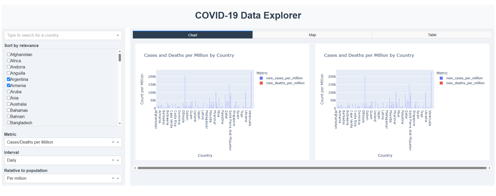
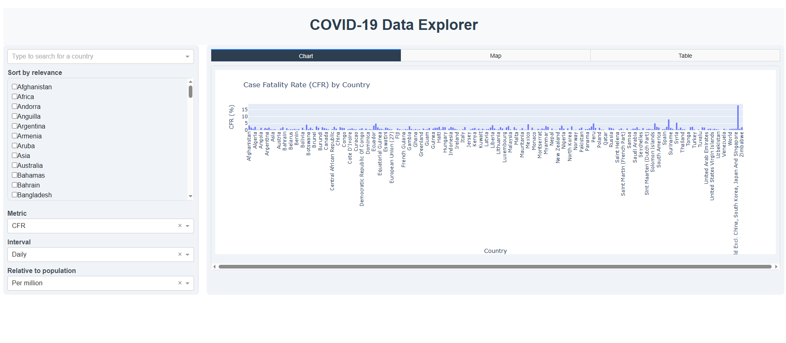
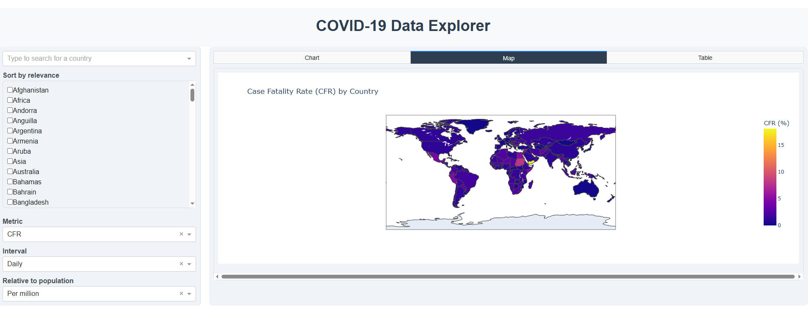
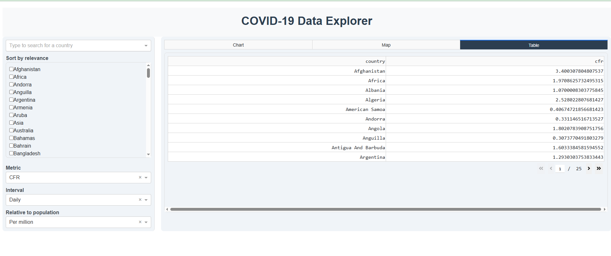
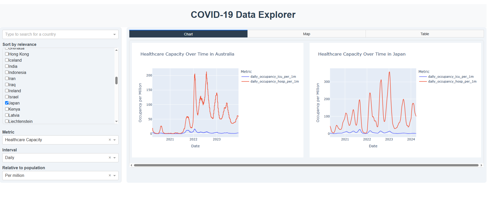

# Covid-19 Analysis Project Documentation

## 1. Project Overview

### Project Name:
**Covid-19 Analysis**

### Description:
Covid-19 Analysis is a comprehensive project that examines various aspects of COVID-19, including cases, deaths, vaccinations, policies, mortality, and mobility. The goal is to analyze the impact of COVID-19 globally and on a country-wise level, assessing how different regions handled the pandemic.

### Purpose:
- To provide a detailed analysis of COVID-19 trends worldwide.
- To assess the effectiveness of policies and healthcare responses.
- To offer forecasting for the next 30 days using machine learning techniques.
- To facilitate clustering and regression analysis for deeper insights.

## 2. Motivation

The primary motivation behind this project was to build an end-to-end data analysis solution using real-world data. This project not only enhanced my technical, analytical, and machine learning skills but also provided a deeper understanding of COVID-19 trends. Inspired by "Our World in Data," I decided to develop an interactive dashboard with advanced analytical capabilities.

## 3. Project Features

### COVID-19 Analyses:
- Case fatality rate (CFR) analysis
- Weekly/Biweekly growth trends
- Cases and deaths per million
- Policy impact on cases, deaths, mobility, and vaccination
- Reproduction rate trends
- Testing efficiency and healthcare capacity
- Mobility trends across different countries
- Vaccination trends, attitudes, and manufacturer statistics
- Excess mortality trends and projections

### Machine Learning Techniques:
- **Forecasting:** 30-day predictions for COVID-19 trends
- **Clustering:** Grouping similar countries based on COVID-19 response
- **Regression Analysis:** Finding correlations between policies, cases, deaths, and vaccinations

## 4. Technology Stack

- **Language:** Python (3.9.x)
- **Frameworks & Libraries:** Dash, Plotly, Pandas, NumPy, Scikit-learn, Matplotlib, Seaborn
- **Development Environment:** PyCharm

## 5. System Requirements

- **Python Version:** 3.9.x
- **Minimum RAM:** 8GB (16GB recommended for optimal performance)
- **Required Libraries:** Install via `pip install -r requirements.txt`

## 6. Project Setup & Installation

1. Clone or download the project repository.
2. Install the required dependencies:
   ```bash
   pip install -r requirements.txt
   ```
3. Download the necessary dataset from Google Drive: [COVID-19 Data](https://drive.google.com/drive/folders/1iGabf01A3lIFzfWLsUZtwUGLtr_2Ta0x?usp=sharing)
4. Extract the two folders from the downloaded data and place them inside the `Covid_19_Project` folder.
5. Run the dashboard:
   ```bash
   python dashboard.py
   ```
6. The dashboard will launch in your browser, ready for analysis.

## 7. Dashboard Explanation

- **Left Panel:** Contains filters (country selection, analysis type).
- **Right Panel:** Displays visualizations (charts, maps, tables).
- **Interactivity:** Users can switch between different types of analyses.
- **Data Availability:** If no visualization appears, the dataset may not contain data for that country.

## 8. Data Source & Citations

**Primary Data Source:** [Our World in Data](https://ourworldindata.org/coronavirus)

### Required Citations:
- **Vaccination Data:**
  - Mathieu, E., Ritchie, H., Ortiz-Ospina, E. et al. A global database of COVID-19 vaccinations. Nat Hum Behav (2021). https://doi.org/10.1038/s41562-021-01122-8
- **Testing Data:**
  - Hasell, J., Mathieu, E., Beltekian, D. et al. A cross-country database of COVID-19 testing. Sci Data 7, 345 (2020). https://doi.org/10.1038/s41597-020-00688-8

## 9. Project Architecture

### File Structure:
```
Covid_19_Project/
├── Analysis_Scripts/        # All analysis scripts
├── Cleaned_data/            # Processed datasets
├── data_cleaning_scripts/   # Data cleaning scripts
├── ML_Models/               # Machine learning models and scripts
├── OWID_Covid_Data/         # Original datasets (Download separately)
├── Images/                  # Dashboard snapshots
├── dashboard.py             # Main entry point
```

### Main Classes:
- `CasesDeathAnalysis`
- `VaccinationAnalysis`
- `ExcessMortalityAnalysis`
- `MobilityAnalysis`
- `PolicyAnalysis`
- `TestingHealthcareAnalysis`

## 10. Challenges Faced

- **Class Structure & Library Selection:** Choosing the best structure for classes and deciding between Matplotlib/Seaborn vs. Plotly for visualization.
- **Dash Integration:** Creating a dynamic and interactive layout while maintaining performance.
- **Data Processing:** Cleaning and merging large datasets efficiently.
- **Machine Learning Implementation:** Integrating forecasting and clustering models into the analysis.

## 11. Dashboard Snapshots

Below are some snapshots of the dashboard visualizations:

- **Cases and Deaths per Million by Country**
  
- **Case Fatality Rate by Country**
  
- **Case Fatality Rate - Map View**
  
- **Case Fatality Rate - Table View**
  
- **Health Capacity Over Time in Australia**
  
- **Mobility vs. Case Growth in Argentina**
  
- **Policy Effectiveness by Country**
  
- **Testing Rates by Country**
  
- **Testing Rates and Healthcare Capacity by Country**
  
- **Vaccination Rates Over Time in Argentina**
  

## 12. License & Usage

- This project is **free to use**.
- Users are encouraged to modify and extend it as needed.
- I would appreciate credit if someone uses or builds upon this project.
